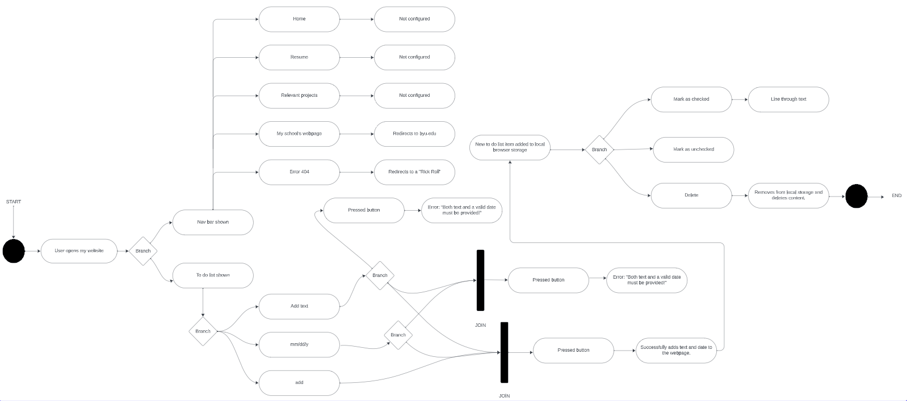
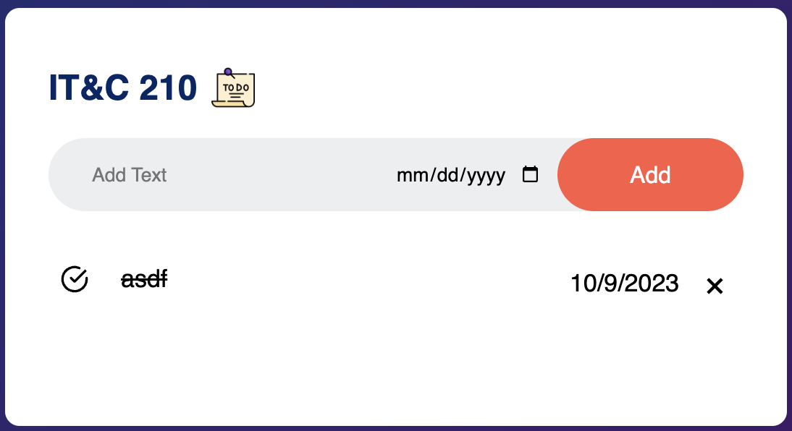

# Introduction 

#### Jackson Stephens
#### 10/06/2023
#### Lab 2: Javascript + DNS/HTTPS

# Executive Summary

In this lab, I implemented a secure web connection for my webpage by creating DNS entries, obtaining an SSL certificate, 
and enabling HTTPS. Additionally, I incorporated my past HTML and CCS to build a dynamic JavaScript web application, allowing 
users to manage to-do list tasks using local storage. This lab enhanced my understanding of web security and hosting, server 
configurations, client-side scripting and debugging, and web deveolpment programming fundamentals.

# Design Overview 

For my webpage, I decided to go for a sleek, modern look. I added a gradient of purple and orange to the background of the to-do list. 
I also added white accents of the navigation bar and to-do list housing. I made a particular effort to add vector graphics to my webpage 
for consistency across devices.
 
1. 
 
When you want to add a task to the to-do list, you must add both a date and text. Considering one field was empty, you would be prompted
with an error message. Additionally, when you finish a task, you have the option of either adding a line through the task, or deleting it 
entirely. By crossing it out, you are able to keep the task in local storage, saving between sessions. If you were to delete the task, it 
would be removed from local storage. 
 

2. 
3. 

## Files used: 

src: the src folder is the general folder that holds all of my other website elements. 

docker-compose.yml: this was the configuration file for my Docker container hosting the Apache HTTP server. 
This image being port forwarded, and mapped to the src folder. 

index.html: I added the link to my JavaScript at the bottom of the body tag in my HTML file. 

script.js: this is where I wrote my CRUD functions and associated JavaScript. 

images: check-circle.svg, circle.svg, to-do.png.

Markup_images: website images and UML diagram hosting. 

# Writeup Questions

- What is the difference between http and https? 
HTTP is unencrypted while HTTPS is encrypted. 

- What does the A record do in your DNS domain? 
An A record maps a domain to a specific IPv4 address, replacing the IP with your domain name. 

- Which key does the `certbot` tool send to Let's Encrypt to be embedded in the certificate; the public key or the private key? 
Certbot sends the public key to Let's Encrypt so it can be embedded in the SSL certificate. 

- What is the TTL setting in DNS, what are the units, and what does it do? 
The TTL setting in DNS stands for time-to-live. The units associated are seconds and it controls the DNS propagation speed. 

- The DNS tool is new this semester. What did you like about it? What could we do to improve it? (Any answer gets full credit.) 
I thought it was great. Instructions were very thorough. I liked being able to give my website a unique name. 

- What are two differences and similarities between JavaScript and a previous language you have used (e.g. C++ or Python)? (Think of differences and similarities that are more unique to these 2 languages, not all languages in general.) 
My previous language was Python. These two languages have significantly different syntax and usage. Python is much more loose with syntax 
and formatting, emphasizing indentation for inheritance. On the other hand, JavaScript is similar to a C based langauge, using curly braces 
and semicolon syntax. However, they're similar because they're both high level interpreted languages. They're both also object oriented. 

- What is the difference between JSON and JavaScript objects? 
The main difference between JSON and JavaScript objects is the specific use case of each. JSON is generally used for transmitting data
 between systems. Whereas JavaScript objects are data structures used in code to organize and manipulate data. 

- If you open your web page in two different browsers, will changes on one appear on the other? Why or why not? 
No, because each browser has it's own local storage. 

- How long did you spend on this lab?   
I spent around seven hours on this lab.

# Lessons Learned 

***Problem: Configuring DNS Entries***
- **Solution:** I had never worked with DNS before, so the configuration process was a bit tricky. I found out that I was running into 
syntactical issues while tying to claim my domain `megatron` on the class DNS server, which also affected my creation of an A record for 
my server's IP. After re-reading instrucitons and loads of trial and error, I was able to solve this issue. 

***Problem: Implementing CRUD Operations in JavaScript***
- **Solution:** Creating cohesive CRUD functions is a daunting task when you haven't worked with JavaScript in over four years. With that being said, 
I was able to use the internet as a resource to help me write them out. I searched for resources on Stackoverflow and Youtube that ended up being
incredibly helpful.

***Problem: Updating SSL Certificate Ownership***
- **Solution:** After setting up my SSL certificate in my Apache server, my webpage still wasn't showing the certificate. I was incredibly confused
and wondered why this was happening. After troubleshooting for a few minutes, I realized that I had to restart Apache  in order for the 
changes to fully take effect. 

# Conclusion 

- **Skills Acquired:**
  - Establishing DNS entries for domain mapping
  - Configuring and verifying SSL certificates for secure web connections
  - Creating CRUD operations in JavaScript for dynamic web applications 
  - Utilizing event listeners and local storage for my webpage

# References 

[Let's Encrypt](https://letsencrypt.org/getting-started/) 
[MDN Web Docs](https://developer.mozilla.org/en-US/docs/Web/JavaScript/Guide) 
[Web3Schools](https://www.w3schools.com/) 
[StackOverflow](https://stackoverflow.com/) 
[MozillaCSSGITLab](https://developer.mozilla.org/en-US/docs/Web/CSS) 
[HTMLOverview](https://html.com/) 
[JavaScriptOverview](https://www.javascript.com/) 
[YouTube](https://www.youtube.com/) 